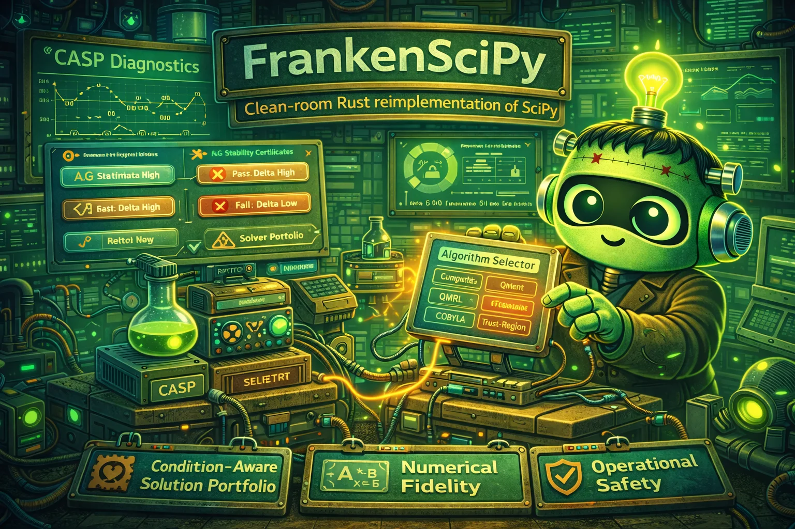

# FrankenSciPy

  

FrankenSciPy is a clean-room Rust reimplementation targeting grand-scope excellence: semantic fidelity, mathematical rigor, operational safety, and profile-proven performance.

## What Makes This Project Special

Condition-Aware Solver Portfolio (CASP): runtime algorithm selection driven by conditioning diagnostics and stability certificates.

This is treated as a core identity constraint, not a best-effort nice-to-have.

## Methodological DNA

This project uses four pervasive disciplines:

1. alien-artifact-coding for decision theory, confidence calibration, and explainability.
2. extreme-software-optimization for profile-first, proof-backed performance work.
3. RaptorQ-everywhere for self-healing durability of long-lived artifacts and state.
4. frankenlibc/frankenfs compatibility-security thinking: strict vs hardened mode separation, fail-closed compatibility gates, and explicit drift ledgers.

## Current State

- project charter docs established
- legacy oracle cloned:
  - /dp/frankenscipy/legacy_scipy_code/scipy
- first conformance vertical slices landed:
  - `FSCI-P2C-001` tolerance validation packet
  - `FSCI-P2C-002` dense linalg packet
  - RaptorQ + decode-proof artifact generation in `fsci-conformance`
  - interactive `ftui` dashboard binary for artifact navigation

## V1 Scope

- scoped linalg/sparse/opt/stats/signal families; - explicit tolerance policies; - core scientific benchmark corpus.

## Architecture Direction

high-level API -> domain module -> algorithm selector -> numeric kernel -> diagnostics

## Compatibility and Security Stance

Preserve SciPy-observable behavior for scoped routines with explicit tolerance/equality policies.

Defend against numerical instability abuse, malformed array metadata, and unsafe fallback paths under ill-conditioned inputs.

## Performance and Correctness Bar

Track solver runtime tails, convergence costs, and memory budgets; gate regressions for core routine families.

Maintain conditioning-aware fallback, convergence, and tolerance invariants for scoped algorithms.

## Key Documents

- AGENTS.md
- COMPREHENSIVE_SPEC_FOR_FRANKENSCIPY_V1.md
- SPEC_CROSSWALK_FRANKENSQLITE_TO_FRANKENSCIPY.md
- reference/frankensqlite/COMPREHENSIVE_SPEC_FOR_FRANKENSQLITE_V1.md

## Next Steps

1. Expand `FSCI-P2C-002` from core solves to broader decomposition/structured matrix coverage.
2. Add SciPy-present CI lane for real oracle capture (`oracle_capture.json`) and drift diffs.
3. Add benchmark baselines + profile artifacts for linalg tail latency and memory.
4. Extend dashboard with mismatch drill-down and oracle-vs-target numeric deltas.
5. Land first optimize/root packet (`FSCI-P2C-003`) with the same artifact discipline.

## Porting Artifact Set

- PLAN_TO_PORT_SCIPY_TO_RUST.md
- EXISTING_SCIPY_STRUCTURE.md
- PROPOSED_ARCHITECTURE.md
- FEATURE_PARITY.md

These four docs are now the canonical porting-to-rust workflow for this repo.

## Conformance Workflow

- Run baseline conformance packets:
  - `cargo test -p fsci-conformance -- --nocapture`
- Run full quality gate stack:
  - `cargo fmt --check`
  - `cargo check --all-targets`
  - `cargo clippy --all-targets -- -D warnings`
  - `cargo test --workspace`
  - `cargo bench`
- Launch interactive artifact dashboard:
  - `cargo run -p fsci-conformance --bin conformance_dashboard -- --artifact-root crates/fsci-conformance/fixtures/artifacts --packet-filter P2C-002`

## Python Oracle Capture

- Oracle script path:
  - `crates/fsci-conformance/python_oracle/scipy_linalg_oracle.py`
- The Rust harness can run this script via:
  - `capture_linalg_oracle(...)`
  - `run_linalg_packet_with_oracle_capture(...)`
- If SciPy is unavailable, harness behavior is explicit:
  - strict requirement (`required=true`) returns `PythonSciPyMissing`
  - optional requirement (`required=false`) writes `oracle_capture.error.txt` and continues
